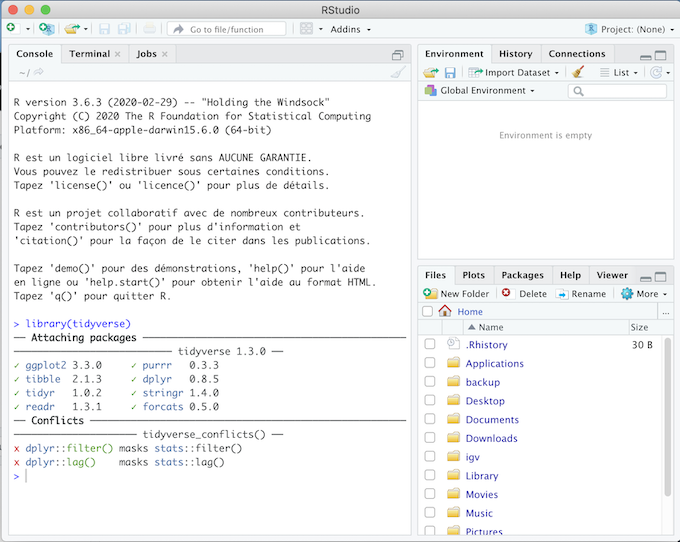

**Quand:** Les 19, 23 et 26 Novembre 2021 

**Instructrice:** 
[Sandra Cortijo](mailto:sandra.cortijo@cnrs.fr)

## Description

Ce cours va vous apprendre comment exporer des données et réaliser des graphiques dans **R**. 
Les différentes séances sont (avec accès au cours):

 

### Séance 1: 19/11/2021 9h45-13h (salle 5.129).

[Faire des graphiques avec R, lien vers le matériel](session1/materiel/session1.html)  

[Solution des exercices](session1/materiel/session1_exercise_solutions.html)

### Séance 2: 23/11/2021 11h30-13h (salle 5.129) et 13h30-15h (salle 36.204). 

[Ajouter des statistiques à des graphiques, lien vers le matériel](session2/materiel/session2.html)  

[Solution des exercices](session2/materiel/session2_exercise_solutions.html)

### Séance 3:  26/11/2021 9h45-13h (salle 36.202). 

[Réorganiser les données, lien vers le matériel](session3/materiel/session3.html)  

[Solution des exercices](session3/materiel/session3_exercise_solutions.html)

Deuxième partie:
**Travail de groupe: Exploration de données**

**A VENIR** [Guide pour l'examen]()

 

## Examen final

L'examen final sera sous la forme d'un projet de groupe. Le but sera d'analyser les données du TD du module de M1 Bioinformatique : données et bases de données (HAA812V), à partir duquel vous aurez créé un fichier bien organisé dans la partie de notre module sur les bases de données (avec Isabelle Mougenot). Ce fichier contiendra les données de longueur de racine pour plusieurs génotypes, qui ont poussés dans différents milieux et pour lesquels vous avez des valeurs mesurées sur plusieurs années.  

Vous commencerez à travailler sur ce projet de groupe lors de la dernière séance, et devrez le rendre le vendredi 17 Décembre 2021 à minuit au plus tard.  

[Guide pour l'examen]()

 

 

### Lien vers d'autres matériels de cours qui pourront être utiles

[Antisèches](https://www.rstudio.com/resources/cheatsheets/)

[Comment trouver de l'aide](astuces.html)

[Comment choisir le bon type de graphique](https://www.data-to-viz.com/#explore)

[Erreurs à éviter qand on fait des graphiques](https://www.data-to-viz.com/caveats.html)

[Lien vers un cours de R plus complet](https://scortijo.github.io/2021_L3_R/)

 

 

## Si vous voulez utiliser R chez vous: 
Il est recommandé d'utiliser R régulièrement pour bien comprendre et aprendre. Pour cela le mieux est d'installer **R** et **R studio** sur votre ordinateur:

[Installer R](https://cran.biotools.fr/)

[Installer Rstudio](https://rstudio.com/products/rstudio/download/)

Dans chaque cas, téléchargez la version pour votre système opérateur (Mac, Windows ou Linux) et installez les programmes normalement.

Vous devez aussi avoir les packages `tidyverse`, `visdat` et `plotly` installés. 
Pour cela:
1. Assurez vous d'avoir acces à internet
2. Ouvrez Rstudio
3. Dans la "console" (panel en haut à gauche), tapez `install.packages(c("tidyverse","visdat", "plotly"))` puis enter
4. Assurez vous que l'installation a fonctionné en tapant `library(tidyverse)` (puis faites la même chose avec `visdat` et `plotly`)
5. Le message affiché doit être similaire à la capture d'écran ci-dessous. Si vous avez un message du type: 
"Error in library(tidyverse): there is no package called 'tidyverse'"
**contactez un des instructeurs**.

## Liens utiles: 

[Toutes les anti-sèches R](https://www.rstudio.com/resources/cheatsheets/)

[Conseils de visualisation de données](https://www.data-to-viz.com/)

