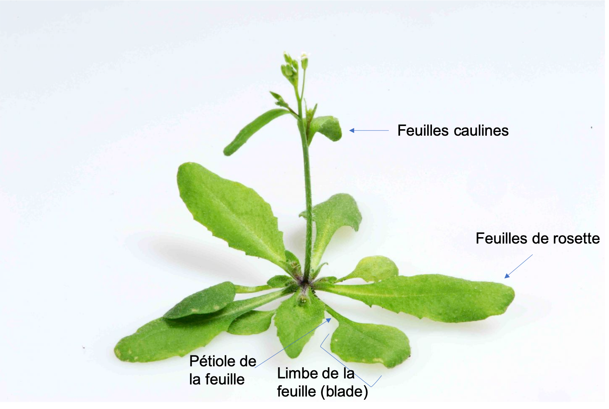

```{r setup, include=FALSE}
knitr::opts_chunk$set(echo = TRUE)
```
<br>

[Retour à la page d'accueil](https://scortijo.github.io/2021_M2_R/)

<br>


Lors de cette séance nous allons apprendre:

1. A organiser les données dans un fichier excel afin que ce soit compatible avec leur import dans ``R``

2. A charger les données dans R et vérifier leur structure

3. A faire des graphiques avec `ggplot2` 

4. A créer des graphiques avec des `facets`

<br>

# 1. Organisation des données dans un tableur

Adapté de [ce cours](https://datacarpentry.org/spreadsheet-ecology-lesson/)

## Pourquoi bien organiser les données dans un fichier?

Il est crucial d'avoir des données bien organisées afin de pouvoir les étudier correctement. Bien que formater, nettoyer et organiser les données peut être long et pénible, c'est une étape essentielle pour l'analyse ultérieure des données.

La plupart d'entre nous utilisent à un moment donné ou à un autre, un tableur ("Excel") pour y enregistrer des données. Nous allons voir dans tableur:

- comment éviter les pièges courants quand nous enregistrons des données

- les bonnes habitudes pour organiser les données

- les différents formats et leur compatibilité avec d'autres programmes (comme ``R``)


{width=80%}


{width=80%}

<br>

## Bonnes habitudes pour organiser les données dans un tableur

- **Ne modifiez jamais les données brutes!** Toujours travailler sur une copie des données.
  C'est essentiel, surtout dans un logiciel comme excel, ou les modifications des données ne sont pas enregistrées. Si par exemple vous faites une erreur et ne le réalisez que plus tard (genre, des mois plus tard), c'est très difficile voir impossible de revenir sur les données brutes et de corriger l'erreur.

- **Notez et conservez l'information des manipulations de vos données.** 
  Par exemple, écrivez ces informations dans un document README ou dans un onglet séparé dans excel.

- Toutes les données d'une expérience doivent être dans **un seul et même tableau**:
  - **Les colonnes** doivent contenir **les variables** (ce qui est mesuré)
  - **Les lignes** doivent contenir **les observations** (les unités de l'étude)


{width=70%}

<br>


>### Exercice:
>
> Une étude a été faite pour déterminer le sexe et le poids des animaux attrapés dans différentes parcelles expérimentales. L'expérience a été répétées sur deux années.      
>
> - Ouvrez le fichier "dataset_messy.xls" situé dans le dossier "session1_organisation/data". Ce fichier contient les données enregistrées lors de l'étude.
> - A partir des bonnes habitudes d'organisation indiquées plus haut, identifiez les problèmes de format dans ces données. Discutez-en 
>

## Problèmes dans l'organisation des données


- Les données ne doivent pas être éparpillées dans plusieurs tableaux ou onglets

- Les données manquantes doivent être indiquées par une cellule vide ou un "NA". Un zéro doit être utilisé pour les zéros et non pour des données manquantes.

- Le formatage (gras, cellules colorées etc) et commentaires ne doivent pas être utilisés. Les données importantes doivent être associées à une variable (par exemple dans le nom de la colonne).

- Ne pas utiliser de caractères spéciaux (comme `!`, `#`, `*`).

- Pour que ce soit compatible avec R, utiliser `_` plutôt que des espaces entre les mots.

- *Attention aux dates!* Cela peut causer des problèmes de format d'un tableaur à un autre. Le mieux est de garder le jour, le mois et l'années commes des variables (colonnes) séparées
    


## Exporter les données

Bien que excel est souvent utilisé, son format de fichier par défault n'est malheureusement pas compatible avec d'autres programmes, y compris ``R``. Pour cela le mieux est d'enregistrer les données tabulaires dans un format texte.  

Les deux formats les plus utilisés sont:

_CSV_ (séparateur: virgule (UK, US) ou point-virgule (EU))


_TXT_ (séparateur: tabulation)


**Attention**: les documents avec un format _CSV_ qui ont un séparateur virgule ou un séparetur point-virgule ne sont pas la même chose. Les confondre peut poser des problèmes lors de l'import des données dans ``R``. C'est pourquoi nous recommendons de sauver les données en format _TXT_ (séparateur: tabulation) pour ensuite pouvoir les importer dans  ``R`.

Pour cela, dans excel, choisissez "Enregistrez sous" et ensuite sélectionnez le format _TXT_ (séparateur: tabulation) .


>### Exercice:
>
>- Ouvrez le fichier "dataset_tidy.xls" dans le dossier "session1_organisation/data"
>- Regardez le tableau, est-ce que vous pouvez comprendre ce qu'il contient?  
>- Exportez les données au format _TXT_ (séparateur: tabulation) et sauvez le dans le dossier "session1_organisation/data"  


<br>


# 2. Importer des données dans R et vérifier leur intégrité


## Mise en place


**Création du projet R**

Lors de cette séance nous allons utiliser plusieurs packages qui contiennent les fonctions dont nous avons besoin:  
- `tidyverse` qui contient plusieurs packages dont `ggplot2`  
- `visdat`  qui permet une représentation rapide des données  
- `plotly` pour faire des graphiques interactifs  


Ces packages sont normalement déjà installés. Pour les importer dans votre session, utilisez la fonction ``library()`` : 

```{r load packages, eval = TRUE, message = FALSE}
library(tidyverse)
library(visdat)
library(plotly)
```


## Import et vérification des données

Pour cette formation, nous allons utiliser une version légèrement modifiée du jeu de données publié par [Burghard et al 2015](http://datadryad.org/resource/doi:10.5061/dryad.65d76). 

Il s'agit d'une expérience de phénotypage de plantes d'*Arabidopsis thaliana* qui ont poussé dans différentes conditions:

- A 12°C ou à 22°C
- Avec une température constante ou qui fluctue dans la journée
- Avec une période de 8h de jour ou de 16h de jour par cycle de 24h
- Avec un traitement de froid qui immite l'hiver (vernalisation)

Des plantes de différents génotypes ont été analysées: des mutants et sauvages et des écotypes différents.

Pour chaque plante dans chaque condition plusieurs phénotypes ont été mesurés (voir illustration ci-dessous pour mieux comprendre les termes):

- Le nombre de jour pour que la tige (qui contient les fleurs) emmerge: _days to bolt_
- Le nombre de jour pour que la première fleur s'ouvre: _days to flower_
- Le nombre de feuilles dans la rosette à la fin de l'expérience: _rosette leaf num_
- Le nombre de feuilles caulines à la fin de l’expérience: _cauline leaf num_
- La longueur du limbe de la feuille: _blade lenght mm_
- La longueur de la feuille (avec le pétiole et le limbe) _total leaf length mm_

{width=70%} 

Afin de charger les données dans R, et de les garder dans un objet que nous pourrons réutiliser, nous utilisons:

```{r read data}
# Import des données et chargement dans l'objet expt1 
expt1 <- read_tsv("../data/burghardt_et_al_2015_expt1.txt")
```

La fonction `read_tsv()` imprime un message indiquant quel type de données sont contenues dans les différentes colonnes du fichier. 

Dans notre cas, certaines colonnes contiennent des données de type "character" (du texte) et d'autres des données numériques ("double" en présence de décimale, "integer" en absence de décimale).


Pour regarder rapidement les données, tapez le nom de l'objet où sont les données (`expt1`).

```{r head expt1}
expt1
```

Cela va montrer les 10 premières lignes du tableau ainsi que les colonnes qui rentrent dans l'écran. 

> **Exercice:** Combien y a-t-il de lignes et colonnes dans les données?

Une autre option est d'utiliser la fonction  ``View()`` pour accéder à une table interactive où il est possible de trier et filtrer les données sans modifier l'objet:

```{r View, eval = FALSE}
View(expt1)
```

- La fonction ``glimpse()`` permet d'avoir une idée de la structure des données:

```{r str}
glimpse(expt1)
```

> **Exercice** Quel est le type des variables dans les données ? 

- ``dim()`` indique les dimensions du jeu de données (nombre de lignes et colonnes).

```{r dim}
dim(expt1)
```

- Pour les données numériques, la fonction ``summary()`` permet d'obtenir des stats de base pour chaque colonne.  

```{r summary}
summary(expt1)
```

Nous avons déjà utilisé de nombreuses fonctions:

- ``install.packages()``
- ``library()``
- ``read_tsv()``
- ``View()``
- ``glimpse()``
- ``summary()``
- ``dim()``

Il est bien sûr difficile de ce souvenir du nom de toutes ces fonctions, ce qu'elles font et comment les utiliser. 
Heureusement, pour nous aider, une aide est disponible dans R en tapant le nom d'une fonction précédé de `?`

```{r get help}
?summary
```


Bien sur, une recherche sur internet est aussi une solution très efficace pour trouver de l'aide! 

> **Exercice** que fait la fonction ``head()`` ? 

> **Exercice** Comment regarder les dernières lignes de le notre jeu de données? (indice: ``?tail``)


## Inspection visuelle des données

Pour avoir une vue d'ensemble du jeu de données et détecter des problèmes, nous allons utiliser la fonction  ``vis_dat()``.

```{r}
vis_dat(expt1)
```

> **Exercice** Quel est le type de données le plus courant dans le jeu de données ? 
Y a-t-il des problèmes?


# 3. Faires des graphiques avec `ggplot2` 


## Quels types de graphiques pouvons nous faire avec ggplot2?


Il est possible de représenter les données de différentes manières et ggplot2 offre de nombreuses options de visualisation.

Parmi les plus connues:

- [Des barplots](https://www.r-graph-gallery.com/barplot.html) 

- [Des boxplots](https://www.r-graph-gallery.com/boxplot.html) 

- [Des histogrammes](https://www.r-graph-gallery.com/histogram.html) 

Et encore plus. Pour toutes les découvrir, voir [cette galerie de graphiques avec ggplot2](https://www.r-graph-gallery.com/index.html)

Comme il existe de nombreuses options, utilisez [ce guide avec un arbre de décision](https://www.data-to-viz.com/) pour choisir la meilleure méthode de visualisation


{width=70%} 


Maintenant que nous avons vérifié la qualité de notre jeu de donnée, nous pouvons générer des graphiques afin d'en apprendre plus sur les données générées par l'expérience. 

Nous allons utiliser le package R `ggplot2`, qui utilise le principe de "grammar or graphics". Il s'agit des briques du graphique. Cette méthode permettant de combiner et superposer différentes couches de briques:

- data (données)
- aesthetics
- objet géométrique (type de graphique)
- transformations statistiques
- ajustements positionels
- faceting

Les trois premières briques sont essentielles: data, aesthetics et objet géométrique. 

- **data** - Vos données
- **aesthetics** - Ce que l'on veux montrer sur le graphique et qui dépend des données. Par exemple ce qui est en x et y, la couleur, forme, type de ligne, taille, etc... 
Pour cela nous utilisons la fonction `aes()`. 
- **geom_objects** - les objets que nous voulons dans le graphique. Un graphique doit avoir au moins un `geom_object`, et peut en avoir plusieurs. Par exemple:
    - points (`geom_point` pour des scatter plots, dot plots)
    - lignes (`geom_line` pour des tendance, séries chronologiques)    


Pour plus d'information sur la création de graphique avec `ggplot2`, voir [cette antisèche très utile](https://www.rstudio.com/wp-content/uploads/2015/03/ggplot2-cheatsheet.pdf).


Commençons avec un boxplot: Dessinons le `days.to.flower` pour les différents génotypes. 

La fonction `ggplot()` permet de commencer le graphique. Il faut aussi indiquer les données à utiliser:

```{r}
ggplot(expt1)
```

Mais cela ne produit qu'un canevas gris! 

Il nous manque des briques. En l’occurrence nous devons indiquer quelle _aesthetics_ (c'est la terminologie de `ggplot2`) nous voulons sur ce canevas gris. 
Nous devons indiquer quelles sont les variables  _x_ et _y_ du boxplot.

```{r}
ggplot(expt1, aes(x = genotype, y = days.to.flower))
```
 
`ggplot` indique maintenant les variables `genotype` et `days.to.flower` 
de nos données sur les axes _x_ et _y_ du graphique. 

Mais toujours pas de graphique. C'est parce que nous pas indiqué à `ggplot` quelle _géométrie_ nous voulons dessiner sur le canevas. Pour faire un boxplot, nous ajoutons au canevas (littéralement avec un `+`) ``geom_boxplot()``:

```{r}
ggplot(expt1, aes(genotype, days.to.flower)) +
  geom_boxplot()
```

> **Exercice 1:** Pouvez vous dessiner un violin plot? (indice: ``?geom_violin``)


## Ajout de plusieurs couches

Nous allons maintenant ajouter d'autres ``geom_objects`` au même graphique. 
Par exemple, des points pour les valeurs des individus en plus du boxplot:

```{r}
ggplot(expt1, aes(genotype, rosette.leaf.num)) +
  geom_jitter() +
  geom_boxplot()
```

>**Exercice 2:** Modifiez le graphique pour que les points soient devant plutôt que derrière les boxplots. 


## Couleurs!

Changeons la couleur des boxplots:

```{r}
ggplot(expt1, aes(genotype, days.to.flower)) +
  geom_boxplot(colour = "red")
```

Ou la couleur à l’intérieur ( _fill_) des boxplots:

```{r}
ggplot(expt1, aes(genotype, days.to.flower)) +
  geom_boxplot(colour = "red", fill = "royalblue")
```

Ou même leur transparence:

```{r}
ggplot(expt1, aes(genotype, days.to.flower)) +
  geom_boxplot(colour = "red", fill = "royalblue", alpha = 0.5)
```

C'est sympa, mais cela ne nous apporte pas d'information en plus sur les données. 

Par exemple, ajoutons une couleur qui change en fonction d'un des traitements auquel les plantes ont été exposées (par exemple `fluctuation`). En langage `ggplot2`, nous voulons lier la valeur de la variable `fluctuation` à la couleur dans l' _aesthetic_ du graphique. 

Nous devons donc inclure cette information dans `aes()`:

```{r}
ggplot(expt1, aes(genotype, days.to.flower, colour = fluctuation)) +
  geom_boxplot()
```

Wow! ggplot a automatiquement séparé les données de chaque génotype en deux groupes en fonction de `fluctuation` et leur a attribué une couleur. 

Imaginons que nous voulons ajouter les points pour les valeurs des individus, sans couleur, derrière les boxplots colorés:

```{r}
ggplot(expt1, aes(genotype, days.to.flower, colour = fluctuation)) +
  geom_jitter() +
  geom_boxplot(alpha = 0.5)
```

Ce n'est pas ce que nous voulons. L'aesthetique `colour` a été liée à _toutes_ les géométries du graphique. C'est parce qu'elle a été définie dans la fonction `ggplot()`, qui affecte tous les `geom_object` qui viennent après.  

Mais nous pouvons aussi définir l'aesthetique dans chaque géométrie:

```{r}
ggplot(expt1, aes(genotype, days.to.flower)) +
  geom_jitter() +
  geom_boxplot(aes(fill = fluctuation), alpha = 0.5)
```

>**Exercice 3:** Nous voulons étudier la relation entre le nombre de feuille de rosette et la longueur la limbe des feuilles (en mm) pour les génotypes. 
>
> Pour cela, dessinez un scatter plot (`geom_point()`) entre `blade.length.mm` et `rosette.leaf.num` en colorant les points en fonction de `genotype`. 
>
> Que se passe t-il si les points sont colorés en fonction de `days.to.bolt`?


# 4. Créer des graphiques avec des `facets`

Souvent trop de variables, ou de groupes, sont dans nos données pour pouvoir uniquement utiliser les couleurs pour les discriminer.  

C'est le cas par exemple du scatterplot produit dans l'exercice précédent, où les points sont colorés en fonction du génotype. Il est difficile de bien discerner les données pour chaque génotype car ils sont très rapprochés. L'idéal serait d'avoir un scatterplot par génotype.   

Ceci est assez facile à faire avec`ggplot2`, il suffit d'ajouter une couche au graphique appelée "facet":  

- `facet_grid()` - qui permet d'organiser les panneaux du graphique en lignes et/ou colonnes  
- `facet_wrap()` - qui permet d'organiser les panneaux du graphique à la suite les uns des autres qui reviennent à la ligne après un certain nombre de panneaux.  

Voyons comment `facet_grid()` fonctionne:

```{r}
ggplot(expt1, aes(blade.length.mm, rosette.leaf.num, colour = genotype)) +
    geom_point() +
    facet_grid(genotype ~ temperature)
```

Dans `facet_grid()`, nous utilisons la notation `(ligne ~ colonne)` pour définir les variables qui sont utilisées pour séparer les panneaux en ligne et colonnes.

>**Exercice 4:** Les couleurs n'apportent plus d'information supplémentaire. Pensez à une utilisation plus intéressante des couleurs dans ce graphique. 

Il est possible de ne préciser qu'une variable dans `facet_grid()` :

```{r}
# Faceter en ligne
ggplot(expt1, aes(blade.length.mm, rosette.leaf.num, colour = fluctuation)) +
    geom_point() +
    facet_grid(genotype ~ .)

# Faceter en colonne
ggplot(expt1, aes(blade.length.mm, rosette.leaf.num, colour = fluctuation)) +
    geom_point() +
    facet_grid(. ~ genotype)
```

Il est aussi possible d'utiliser `facet_wrap()` si l'on n'utilise qu'une variable pour séparer les données :

```{r decomposed plot}
ggplot(expt1, aes(blade.length.mm, rosette.leaf.num, colour = fluctuation)) +
    geom_point() +
    facet_wrap( ~ genotype)
```

>**Exercice 5:** Modifiez le graphique précédent afin de séparer les données (facet) en fonction de `fluctuation` en ligne, et `day.length` en colonne et de colorer les points en fonction du génotype.

```{r, echo = FALSE}
ggplot(expt1, aes(blade.length.mm, rosette.leaf.num, colour = genotype)) +
  geom_point() +
  facet_grid(fluctuation ~ day.length)
```

En conclusion, **il est possible de représenter de nombreuses informations en combinant efficacement facets, couleurs et autres aesthetiques!**


-----

>**Exercice 6**: Reproduisez le graphique suivant (ou quelque chose d'approchant): 
. 
>
>**Indice**: facet le graphique avec `day.length` et `temperature` et colorer l'intérieur des boxplot en fonction de `fluctuation`.


# Ressources et liens utiles

- [A Quick Guide to Organizing Computational Biology Projects](https://journals.plos.org/ploscompbiol/article?id=10.1371/journal.pcbi.1000424)


- [Ten Simple Rules for Digital Data Storage](https://journals.plos.org/ploscompbiol/article?id=10.1371/journal.pcbi.1005097)


- [Formatting data tables in Spreadsheets](https://datacarpentry.org/spreadsheet-ecology-lesson/01-format-data/)

- [Gallerie de graphiques pouvant être réalisés avec ggplot2](https://www.r-graph-gallery.com/)


- [Antisèche pour ggplot2](https://rstudio.com/wp-content/uploads/2015/03/ggplot2-cheatsheet.pdf)


******

[Retour à la page d'accueil](https://scortijo.github.io/2021_L3_R/)

<br>

******