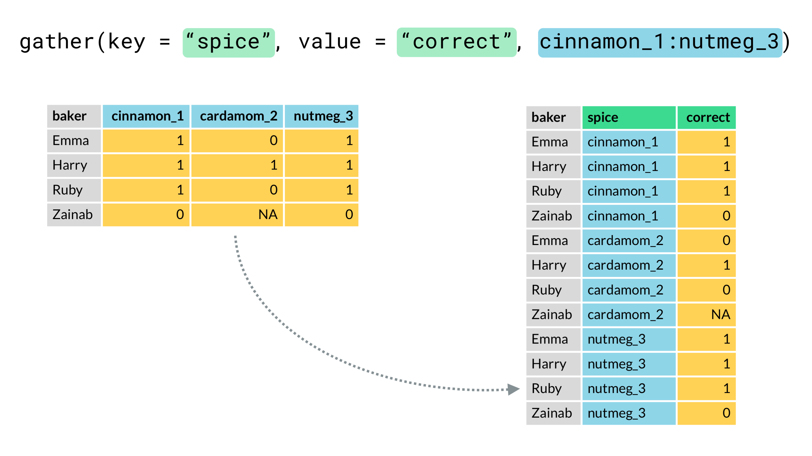

```{r setup, include=FALSE}
knitr::opts_chunk$set(echo = TRUE)
```

<br>

[Retour à la page d'accueil](https://scortijo.github.io/2021_M2_R/)

<br>


Lors de cette séance nous allons apprendre:


1. A ajouter des résultats de tests statistiques à des graphiques

2. A ajouter des statistiques descriptives à des graphiques

3. A sélectionner des lignes avec la fonction `filter` 

4. A représenter des données temporelles 


<br>

# Préparation de l'environnement de travail

Tout d'abord ouvrez le _projet R_, créez un nouveau _script R_ et préparez votre environnement de travail:


```{r}
# Chargez la librairie `tidyverse` (aide: utilisez la fonction `library()`)


# Importer `burghardt_et_al_2015_expt1.txt` et mettez le dans un objet appelé `expt1`
#(aide: utilisez la fonction `read_tsv()`)

```


```{r,  eval = TRUE,message=FALSE, echo=FALSE}
# Chargez la librairie `tidyverse` (aide: utilisez la fonction `library()`)
library(tidyverse)

# Importer `burghardt_et_al_2015_expt1.txt` et mettez le dans un objet appelé `expt1`
#(aide: utilisez la fonction `read_tsv()`)

expt1 <- read_tsv("../data/burghardt_et_al_2015_expt1.txt")

```

<br>


# 1. Ajouter des résultats de tests statistiques à des graphiques

Pour pouvoir rajouter des résultats de tests statistiques à des graphiques, nous allons utiliser des fonctions de la librairie `ggpubr`.


```{r}
library(ggpubr)
```

### Comparaison de moyennes de deux (ou plusieurs) groupes

Afin de faire un test de comparaison de moyennes, nous utilisons la fonction `stat_compare_means`.


```{r}
ggplot(expt1, aes(genotype, days.to.flower, colour = fluctuation)) +
  geom_boxplot() +
  stat_compare_means(label = "p.format", method="t.test")
```

Comme nous avons deux groupes à comparer (température fluctuante vs température constante), la fonction fait la comparaison de ces deux groupes automatiquement pour chaque génotype et donne la p-value associée.

<br>

Plutôt que d'ajouter les valeurs des p-values, il est aussi possible d'utiliser un code à base d'étoiles pour indiquer le niveau de significativité du test:

ns: p > 0.05

*: p <= 0.05

**: p <= 0.01

***: p <= 0.001

****: p <= 0.0001


```{r}
ggplot(expt1, aes(genotype, days.to.flower, colour = fluctuation)) +
  geom_boxplot() +
  stat_compare_means(label = "p.signif", method="t.test")
```

<br>

Par contre, s'il n'y a pas deux groupes clairement identifiés, tous les groupes vont être comparés, en utilisant par défaut avec un test de Kruskal–Wallis: 


```{r}
ggplot(expt1, aes(genotype, days.to.flower)) +
  geom_boxplot() +
  stat_compare_means(label = "p.format")
```


Voir [ce site](http://www.sthda.com/english/articles/24-ggpubr-publication-ready-plots/76-add-p-values-and-significance-levels-to-ggplots/) pour en savoir plus sur les différentes options de tests de comparaison de moyennes (comparaison de deux groupes et de multiples groupes).

<br>

### Tests de corrélation

Il est aussi possible d'ajouter le résultat d'un test de corrélation (spearman ou pearson) à un scatterplot en utilisant la fonction `stat_cor()`:

```{r}
ggplot(expt1, aes(blade.length.mm, rosette.leaf.num)) +
    geom_point()+
  stat_cor()
```

<br>

Par défaut, un test de `pearson` est effectué. Pour utiliser un test de `spearman`, il faut utiliser `method="spearman"`


```{r}
ggplot(expt1, aes(blade.length.mm, rosette.leaf.num)) +
    geom_point()+
  stat_cor(method="spearman")
```


<br> 

Si vous avez plusieurs groupes, `stat_cor` va calculer la corrélation pour chaque groupe.


```{r}
ggplot(expt1, aes(blade.length.mm, rosette.leaf.num, colour = fluctuation)) +
    geom_point()+
  stat_cor()
```

Il est aussi possible d'ajouter une ligne de régression (linéaire ou non), incluant un intervalle de confiance, au graphique avec `geom_smooth()`. Notez cependant, comme on peut le voir ci-dessous, que cette fonction fonctionne mieux pour des régressions linéaires et non complexes.


```{r}
ggplot(expt1, aes(blade.length.mm, rosette.leaf.num, colour = fluctuation)) +
    geom_point()+
  stat_cor() +
  geom_smooth()
```


> **Exercice 1:**
>
> Ajouter le test statistique le plus approprié aux deux graphiques suivant:


```{r}
ggplot(expt1, aes(fluctuation, rosette.leaf.num)) +
  geom_violin() 
```


```{r}
ggplot(expt1, aes(days.to.bolt, days.to.flower)) +
    geom_point() 
  
```
>
> **BONUS:** Ajoutez une ligne de régression (pour le graphique où cela est possible).
Déplacez le résultat du test statistique pour qu'il soit au meilleur endroit sur le graphique.
Qu'est ce que vous pouvez conclure pour chacun de ces graphiques?

<br>

# 2. Ajouter des statistiques descriptives à des graphiques

## Créer des chaînes de commandes avec les pipes `%>%`  

Les "pipes" (`%>%`) permettent de faire une séquence d'opération sur des données, sans avoir besoin de créer des objets intermédiaires (ou de faire des commandes imbriquées très compliquées)

Grace au symbole `%>%` pipe, nous pouvons créer une chaîne de commandes. Pour cela nous devons d'abord faire une commande et ajouter `%>%` à la fin de la ligne qui va utiliser le résultat de cette commande comme input pour la fonction à la ligne suivante. Nous allons utiliser les pipes à partir de maintenant pour créer des chaines de commandes.


## Extraire les statistiques descriptives avec `group_by()` et `summarise()`


Parfois nous voulons résumer nos données dans une table plus petite et en extraire des statistiques descriptives (moyenne, médiane, nombre d'observations ...).

Ce type d'opération peut être fait avec la combinaison de deux fonctions: `group_by()` et `summarise()`.

Notez que `group_by()` ne change pas le format de la table de données. Cette fonction liste des lignes qui doivent être groupées. Nous pouvons ensuite utiliser `summarise()` pour extraire des statistiques descriptives de chaque groupe.


Par exemple, nous pouvons extraire la moyenne pour le temps de floraison de chaque génotype:  

```{r}

group_by(expt1, genotype) %>% 
summarise(mean.days.to.flower = mean(days.to.flower, na.rm = TRUE))

```


L'output contient deux colonnes:

- `genotype` qui est la colonne qui a servi à grouper les données

- `mean.days.to.flower` qui est la colonne crée par la fonction `summarise`

Il n'y a que 10 lignes dans cette table, une par génotype.


Il est possible de grouper les données par plus d'une variable.

Par exemple nous pouvons mesurer la moyenne, la médiane et l'écart type pour chaque génotype aux différentes températures:


```{r}

group_by(expt1, genotype, temperature) %>% 
summarise(mean.days.flower = mean(days.to.flower, na.rm = TRUE),
          sd.days.flower = sd(days.to.flower, na.rm = TRUE),
          median.days.flower = median(days.to.flower, na.rm = TRUE))
```

Il y a maintenant 20 lignes dans la table, car chaque génotype apparaît deux fois (12 et 22 degrés)


Une autre information utile que nous pouvons extraire est le nombre d'observation pour chaque groupe. Pour cela nous devons utiliser la fonction `n()`, dans `summarise()`  qui compte le nombre de ligne pour chaque groupe.

Par exemple, pour connaitre le nombre d'observations pour chaque génotype:


```{r}

group_by(expt1, genotype) %>% 
summarise(n.obs = n())
```


**Attention:** Quand vous utilisez la fonction `group_by()`, les lignes du tableau restent groupées en fonction de la variable utilisée. Les opérations suivantes vont utiliser ces groupes, ce qui peut poser problème. Pensez à utiliser la fonction `ungroup()` pour enlever les groupes quand vous avez fini avec `group_by()` et `summarise()`


> **Exercice 2:**
>
> Calculez la médiane et l'écart-type de `blade.length.mm` et `total.leaf.length.mm` pour chaque `genotype` aux différentes `day.length`. Calculez aussi le nombre d'observations de chaque groupe. 
>


<br>

## Insérer les statistiques descriptives à un graphique

Une autre possibilité est d'ajouter les statistiques descriptives à un graphique contenant les données.

Pour cela, nous devons:

- Utiliser `group_by()` et `summarise()` pour extraire les statistiques descriptives

- Utiliser une fonction de la famille `*_join()` pour les combiner avec nos données

- Nous pouvons maintenant faire un graphique contenant les données et les statistiques descriptives.

Par exemple, prenons ce boxplot:


```{r}

  ggplot( expt1, aes(genotype, rosette.leaf.num)) +
  geom_boxplot()
```


Si nous voulons y ajouter le nombre d'observations pour chaque groupe, nous utilisons le script suivant:

```{r}

group_by(expt1, genotype) %>% 
  summarise(n.obs=n()) %>% 
  mutate(n.obs=paste("n =",n.obs)) %>% 
  full_join(expt1, by="genotype") %>% 
  ggplot( aes(genotype, rosette.leaf.num)) +
  geom_boxplot() +
  geom_text(aes(label=n.obs, x=genotype, y=0))
```


<br>

> **Exercice 3**
>
> Faites un voilin plot de `total.leaf.length.mm` pour chaque génotype et ajoutez la médiane pour chaque groupe (avec un point coloré) ainsi que le nombre d'observation de chaque groupe
>
> 
> **BONUS:** Modifiez le graphique que vous venez de créer pour ajouter les comparaison de moyenne de chaque génotype avec `Col Ama` (comme sur le graphique ci-dessous)


```{r, echo=FALSE, message=FALSE, warning=FALSE}

my_comparisons <- list( c("Col Ama", "Col FRI"), c("Col Ama", "fca-6"),c("Col Ama", "flc-3 FRI"),
                        c("Col Ama", "flk-1"),c("Col Ama", "fve-3"),c("Col Ama", "ld-1"),
                        c("Col Ama", "Ler-1"),c("Col Ama", "prmt5 FRI"),c("Col Ama", "vin3-4 FRI"))


group_by(expt1, genotype) %>% 
  summarise(n.obs=n(),
            mediane.leaf.length=median(total.leaf.length.mm, na.rm=TRUE)) %>% 
  mutate(n.obs=paste("n =",n.obs)) %>% 
  full_join(expt1, by="genotype") %>% 
  ggplot( aes(genotype, total.leaf.length.mm)) +
  geom_violin() +
  geom_point(aes(x=genotype,y=mediane.leaf.length), colour="red") +
  geom_text(aes(label=n.obs, x=genotype, y=0)) +
  stat_compare_means(comparisons = my_comparisons)
```


<br>

Avec cette même méthode il est aussi possible d'ajouter des informations pour des groupes formés à partir de deux variables.

Par exemple, si nous voulons faire un boxplot `rosette.leaf.num` pour chaque génotype en fonction de la température et y ajouter le nombre d'observations des différents groupes, nous utilisons le script suivant:


```{r}

group_by(expt1, genotype, fluctuation) %>% 
  summarise(n.obs=n()) %>% 
  mutate(n.obs=paste("n =",n.obs)) %>% 
  full_join(expt1, by=c("genotype", "fluctuation")) %>% 
  ggplot( aes(genotype, rosette.leaf.num, fill=fluctuation)) +
  geom_boxplot() +
  geom_text(aes(label=n.obs, x=genotype, y=-2),position=position_dodge(0.8), angle=45)
```


# 3. Sélectionner des lignes avec la fonction `filter` 


Avec la fonction `filter()`, nous pouvons garder toutes les lignes de notre table qui correspondent à des plantes qui ont subies une vernalisation.

Tout d'abord, nous devons connaitre les différentes valeurs de la colonne `vernalization`. Comme nous pouvons voir, il y a deux options: 'NV' et 'V'.


```{r}
unique(expt1$vernalization)
```

(**note:** `$` permet de sélectionner une colonne en particulier de la table)

Comme nous voulons garder les plantes qui ont subies une vernalisation, nous devons filtrer les données pour garder les lignes pour lesquelles il y a "V" dans la colonne `vernalization`:


```{r}
filter(expt1, vernalization == "V")
```

Nous pouvons utiliser les opérateurs suivant pour définir les conditions pour filtrer les données:


Opérateur | Condition de sélection  | Exemple
--------- | ----------------------  | ------
`<`       | inférieur à             | `filter(expt1, days.to.bolt < 20)`
`<=`      | inférieur ou égal à     | `filter(expt1, days.to.bolt <= 20)`
`>`       | supérieur à             | `filter(expt1, days.to.bolt > 20)`
`>=`      | supérieur ou égal à     | `filter(expt1, days.to.bolt >= 20)`
`==`      | égal à                  | `filter(expt1, days.to.bolt == 20)`
`!=`      | différent de            | `filter(expt1, days.to.bolt != 20)`
`%in%`    | est contenu dans        | `filter(expt1, genotype %in% c("Col FRI", "Ler-1"))`


Il est aussi possible de combiner plusieurs conditions de sélection avec les opérateurs suivant:

Opérateur | Signification         | Exemple
--------- | --------------------  | ------
`&`       | ET                    | `filter(expt1, days.to.bolt == 20 & genotype == "Ler-1")`
`|`       | OU                    | `filter(expt1, rosette.leaf.num < 8 | rosette.leaf.num > 100)`


Nous pouvons aussi identifier les données manquantes (`NA`) avec la fonction `is.na()` ou sa négation (en utilisant `!`):

Opérateur        | Signification          | Exemple
---------------- | ---------------------  | ------
`is.na()`        | données manquante      | `filter(expt1, is.na(rosette.leaf.num))`
`!is.na()`       | donnée _non_ manquante | `filter(expt1, !is.na(rosette.leaf.num))`


{width=90%}


[source de l'image](https://github.com/allisonhorst/stats-illustrations)


Par exemple, nous pouvons sélectionner les plantes qui ont été vernalisées **ET** qui ont poussées avec une température fluctuante:

```{r, eval = FALSE}
filter(expt1, vernalization == "V" & fluctuation == "Var")
```

Il est aussi possible de sélectionner les plantes qui ont poussées avec 8h de jours **OU** qui fleurissent tardivement:

```{r, eval = FALSE}
filter(expt1, day.length == "8" | days.to.bolt > 85)
```


> **Exercice 2:**
> Filtrez les données pour garder les plantes selon les 3 cas de figures suivant (indépendants les uns des autres):
>
> 1. Plantes qui **ne sont pas du background Ler** et qui ont été traitées avec **une température fluctuante**.
> 2. Plantes qui ont fleuries (bolt) en moins de  **57 jours** et qui ont **moins de 40 feuilles de rosette**
> 3. Plantes du génotype **fca-6** pour qui le **blade.length.mm n'est pas manquant**


# 4. Représenter des données temporelles 

Pour représenter des données temporelles avec une ligne par individu mesuré, nous allons utiliser un autre jeu de données qui contient des transcriptomes effectués sur des plantes d'*Arabidopsis thaliana* ayant été traités pour 15 minutes, 1 heure ou 4 heures avec une température de 17°C ou 27°C.

Tout d'abord, chargeons les données et gardons les dans l’objet `RNAseq`:

```{r}

RNAseq <- read_tsv("../data/data_expression_cortijo2017.txt")

```


L'objectif est d'obtenir un graphique de ce type:


```{r,echo=FALSE, message=FALSE, warning=FALSE}

filter(RNAseq, gene%in%c("AT1G04520","AT3G12580")) %>% 
  gather(key="condition", value="expression", Log2FoldToZero_17c_15min:Log2FoldToZero_27c_4hr) %>% 
  separate(condition, into=c("normalisation", "temperature", "temps")) %>% 
  ggplot(aes(x=temps, y=expression,color=temperature, group=temperature)) +
  geom_line() +
  facet_wrap(~gene, scales="free_y")

```

Pour cela nous devons d'abord filtrer les données pour ne garder que l'expression pour les gènes `AT1G04520` et `AT3G12580`


```{r}

filter(RNAseq, gene%in%c("AT1G04520","AT3G12580")) 

```

Nous obtenons une table avec deux lignes, une par gène; et 8 colonnes, une par condition, plus une avec le cluster.
Afin de pouvoir faire le graphique voulu, il nous faut un tableau avec une colonne contenant la durée de traitement, une autre avec la température de traitement et une troisième avec le niveau d'expression des gènes.  Comme le tableau ci-dessous: 


```{r,echo=FALSE, message=FALSE, warning=FALSE}

filter(RNAseq, gene%in%c("AT1G04520","AT3G12580")) %>% 
  gather(key="condition", value="expression", Log2FoldToZero_17c_15min:Log2FoldToZero_27c_4hr) %>% 
  separate(condition, into=c("normalisation", "temperature", "temps")) 

```


Or ces informations sont dans le titre des colonnes de notre tableau. Pour changer le format et créer une colonne qui contient l'information du titre des colonnes, nous devons utiliser la fonction `gather()`

Voici comment la fonction `gather()` marche:

{width=70%}


[source de l'image](https://campus.datacamp.com/courses/working-with-data-in-the-tidyverse/tidy-your-data?ex=4)

Essayons sur nos données:

```{r}

filter(RNAseq, gene%in%c("AT1G04520","AT3G12580")) %>% 
  gather(key="condition", value="expression", Log2FoldToZero_17c_15min:Log2FoldToZero_27c_4hr)  

```

Nous avons maintenant une colonne `condition`, qui contient le nom des colonnes que nous avons regroupées et une colonne `expression` qui contient les valeurs des colonnes (le niveau d'expression des gènes). Ce n'est pas encore exactement ce dont nous avons besoin car la colonne `condition` contient toutes les informations de l'expérience, mais nous voulons une colonne pour chacune de ces informations: méthode de normalisation, température, durée de traitement.

Pour cela nous allons utiliser la fonction `separate`, qui permet de séparer une colonne en plusieurs colonnes:

```{r,echo=FALSE, message=FALSE, warning=FALSE}

filter(RNAseq, gene%in%c("AT1G04520","AT3G12580")) %>% 
  gather(key="condition", value="expression", Log2FoldToZero_17c_15min:Log2FoldToZero_27c_4hr) %>% 
  separate(condition, into=c("normalisation", "temperature", "temps")) 

```

Nous avons maintenant le format de tableau qui nous permet de faire le graphique voulu, montrant le changement d'expression au cours du temps en réponse au traitement de température pour nos deux gènes d'intérêt.


```{r}

filter(RNAseq, gene%in%c("AT1G04520","AT3G12580")) %>% 
  gather(key="condition", value="expression", Log2FoldToZero_17c_15min:Log2FoldToZero_27c_4hr) %>% 
  separate(condition, into=c("normalisation", "temperature", "temps")) %>% 
  ggplot(aes(x=temps, y=expression,color=temperature, group=temperature)) +
  geom_line() +
  facet_wrap(~gene, scales="free_y")

```

**Attention**: quand nous utilisons `geom_line()`, l'argument `group=` est essentiel pour savoir comment relier les points ensemble en une (ou plusieurs) ligne(s).


-----

<br>


Vous avez vu aujourd'hui, **qu'il est possible de rajouter de nombreuses informations à des graphiques, et de réorganiser vos données pour pouvoir faire la représentation la plus appropriée de vos données**

<br>

-------


<br>

# Ressources et liens utiles


- [Antisèche pour ggplot2](https://raw.githubusercontent.com/rstudio/cheatsheets/main/data-visualization.pdf)

- [Antisèche pour la réorganisation de donnée](https://www.rstudio.com/wp-content/uploads/2015/02/data-wrangling-cheatsheet.pdf)


******

[Retour à la page d'accueil](https://scortijo.github.io/2021_M2_R/)

******
