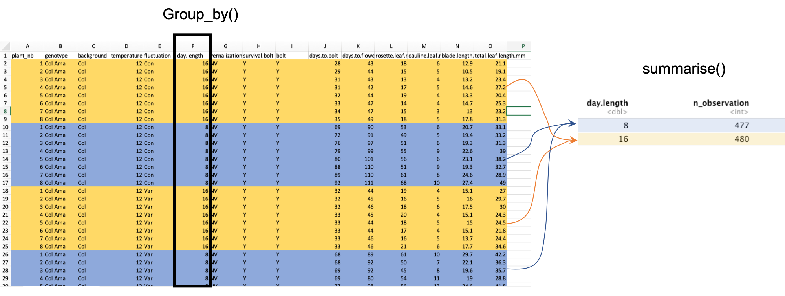

```{r setup, include=FALSE}
knitr::opts_chunk$set(echo = TRUE)
```

<br>

[Retour à la page d'accueil](https://scortijo.github.io/2021_L3_R/)

<br>


Lors de cette séance nous allons apprendre:


2. A ajouter des résultats de tests statistiques à des graphiques

3. A ajouter des statistiques descriptives à des graphiques

4. A représenter des données temporelles (gather et spread)


<br>

# Préparation de l'environnement de travail

Tout d'abord ouvrez le _projet R_, créez un nouveau _script R_ et préparez votre environnement de travail:


```{r}
# Chargez la librairie `tidyverse` (aide: utilisez la fonction `library()`)


# Importer `burghardt_et_al_2015_expt1.txt` et mettez le dans un objet appelé `expt1`
#(aide: utilisez la fonction `read_tsv()`)

```


```{r,  eval = TRUE,message=FALSE, echo=FALSE}
# Chargez la librairie `tidyverse` (aide: utilisez la fonction `library()`)
library(tidyverse)

# Importer `burghardt_et_al_2015_expt1.txt` et mettez le dans un objet appelé `expt1`
#(aide: utilisez la fonction `read_tsv()`)

expt1 <- read_tsv("../data/burghardt_et_al_2015_expt1.txt")

```

<br>


# 1. Ajouter des résultats de tests statistiques à des graphiques


# 2. Ajouter des statistiques descriptives à des graphiques

## Créer des chaînes de commandes avec les pipes `%>%`  

Les "pipes" (`%>%`) permettent de faire une séquence d'opération sur des données, sans avoir besoin de créer des objets intermédiaires (ou de faire des commandes imbriquées très compliquées)

Grace au symbole `%>%` pipe, nous pouvons créer une chaîne de commandes. Pour cela nous devons d'abord faire une commande et ajouter `%>%` à la fin de la ligne qui va utiliser le résultat de cette commande comme input pour la fonction à la ligne suivante. Nous allons utiliser les pipes à partir de maintenant pour créer des chaines de commandes.


## Extraire les statistiques descriptives avec `group_by()` et `summarise()`


Parfois nous voulons résumer nos données dans une table plus petite et en extraire des statistiques descriptives (moyenne, médiane, nombre d'observations ...).

Ce type d'opération peut être fait avec la combinaison de deux fonctions: `group_by()` et `summarise()`.

Notez que `group_by()` ne change pas le format de la table de données. Cette fonction liste des lignes qui doivent être groupées. Nous pouvons ensuite utiliser `summarise()` pour extraire des statistiques descriptives de chaque groupe.





Par exemple, nous pouvons extraire la moyenne pour le temps de floraison de chaque génotype:  

```{r}

group_by(expt1, genotype) %>% 
summarise(mean.days.to.flower = mean(days.to.flower, na.rm = TRUE))

```


L'output contient deux colonnes:

- `genotype` qui est la colonne qui a servi à grouper les données

- `mean.days.to.flower` qui est la colonne crée par la fonction `summarise`

Il n'y a que 10 lignes dans cette table, une par génotype.


Il est possible de grouper les données par plus d'une variable.

Par exemple nous pouvons mesurer la moyenne, la médiane et l'écart type pour chaque génotype aux différentes températures:


```{r}

group_by(expt1, genotype, temperature) %>% 
summarise(mean.days.flower = mean(days.to.flower, na.rm = TRUE),
          sd.days.flower = sd(days.to.flower, na.rm = TRUE),
          median.days.flower = median(days.to.flower, na.rm = TRUE))
```

Il y a maintenant 20 lignes dans la table, car chaque génotype apparaît deux fois (12 et 22 degrés)


Une autre information utile que nous pouvons extraire est le nombre d'observation pour chaque groupe. Pour cela nous devons utiliser la fonction `n()`, dans `summarise()`  qui compte le nombre de ligne pour chaque groupe.

Par exemple, pour connaitre le nombre d'observations pour chaque génotype:


```{r}

group_by(expt1, genotype) %>% 
summarise(n.obs = n())
```


**Attention:** Quand vous utilisez la fonction `group_by()`, les lignes du tableau restent groupées en fonction de la variable utilisée. Les opérations suivantes vont utiliser ces groupes, ce qui peut poser problème. Pensez à utiliser la fonction `ungroup()` pour enlever les groupes quand vous avez fini avec `group_by()` et `summarise()`


> **Exercice 1:**
>
> Calculez la médiane et l'écart-type de `blade.length.mm` et `total.leaf.length.mm` pour chaque `genotype` aux différentes `day.length`. Ajoutez aussi le nombre d'observations de chaque groupe 
>
>

<br>

## Insérer les statistiques descriptives à un graphique

Une autre possibilité est d'ajouter les statistiques descriptives à un graphique contenant les données.

Pour cela, nous devons:

- Utiliser `group_by()` et `summarise()` pour extraire les statistiques descriptives

- Utiliser une fonction de la famille `*_join()` pour les combiner avec nos données

- Nous pouvons maintenant faire un graphique contenant les données et les statistiques descriptives.

Par exemple, prenons ce boxplot:


```{r}

  ggplot( expt1, aes(genotype, rosette.leaf.num)) +
  geom_boxplot()
```


Si nous voulons y ajouter le nombre d'observations pour chaque groupe, nous utilisons le script suivant:

```{r}

group_by(expt1, genotype) %>% 
  summarise(n.obs=n()) %>% 
  mutate(n.obs=paste("n =",n.obs)) %>% 
  full_join(expt1, by="genotype") %>% 
  ggplot( aes(genotype, rosette.leaf.num)) +
  geom_boxplot() +
  geom_text(aes(label=n.obs, x=genotype, y=0))
```


<br>

> **Exercice 2**
>
> Faites un voilin plot de `total.leaf.length.mm` pour chaque génotype et ajoutez la médiane pour chaque groupe (avec un point coloré) ainsi que le nombre d'observation de chaque groupe
>
>


<br>

Avec cette même méthode il est aussi possible d'ajouter des informations pour des groupes formés à partir de deux variables.

Par exemple, si nous voulons faire un boxplot `rosette.leaf.num` pour chaque génotype en fonction de la température et y ajouter le nombre d'observations des différents groupes, nous utilisons le script suivant:


```{r}

group_by(expt1, genotype, fluctuation) %>% 
  summarise(n.obs=n()) %>% 
  mutate(n.obs=paste("n =",n.obs)) %>% 
  full_join(expt1, by=c("genotype", "fluctuation")) %>% 
  ggplot( aes(genotype, rosette.leaf.num, fill=fluctuation)) +
  geom_boxplot() +
  geom_text(aes(label=n.obs, x=genotype, y=-2),position=position_dodge(0.8), angle=45)
```


# 3. Représenter des données temporelles (gather)


-----

-------

[Retour à la page d'accueil](https://scortijo.github.io/2021_L3_R/)


