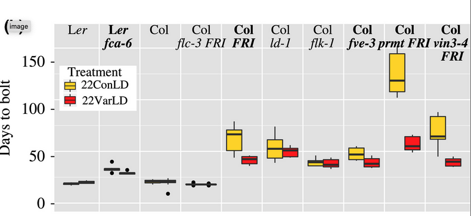

```{r setup, include=FALSE}
knitr::opts_chunk$set(echo = TRUE)
```

<br>

[Retour à la page d'accueil](https://scortijo.github.io/2021_L3_R/)

<br>


Lors de cette séance nous allons apprendre:

1. A changer l'ordre des données dans un graphique 

2. A selectionner des lignes avec la fonction `filter` 

3. A modifier ou créer des colonnes avec la fonction `mutate`


<br>

# Préparation de l'environnement de travail

Tout d'abord ouvrez le _projet R_, créez un nouveau _script R_ et préparez votre environnement de travail:


```{r}
# Chargez la librairie `tidyverse` (aide: utilisez la fonction `library()`)


# Importer `burghardt_et_al_2015_expt1.txt` et mettez le dans un objet appelé `expt1`
#(aide: utilisez la fonction `read_tsv()`)

```


```{r,  eval = TRUE,message=FALSE, echo=FALSE}
# Chargez la librairie `tidyverse` (aide: utilisez la fonction `library()`)
library(tidyverse)

# Importer `burghardt_et_al_2015_expt1.txt` et mettez le dans un objet appelé `expt1`
#(aide: utilisez la fonction `read_tsv()`)

expt1 <- read_tsv("../data/burghardt_et_al_2015_expt1.txt")

```

<br>

# 1. Changer l'ordre des données dans un graphique en utilisant des `facteurs`

Par défaut, les catégories dans un graphique sont ordonnées alphabétiquement. Bien souvent ce n'est pas l'ordre que nous voulons.

Par exemple, essayons de reproduire le graphique suivant:




```{r}
filter(expt1, temperature==22, day.length==16) %>% 
ggplot(aes(x=genotype, y=days.to.bolt, fill=fluctuation)) +
  geom_boxplot()

```


Les génotypes ne sont pas dans le même ordre car ggplot a utilisé l'ordre alphabétique, même s'ils n'étaient pas dans cet ordre dans le tableau.

Afin de changer l'ordre nous devons utiliser un autre type de variable, les **facteurs**. Les facteurs sont des variables spéciales de type caractère pour lesquels nous pouvons définir des niveaux ( _levels_ ), c'est à dire les modalités prédéfinies de cette variable. Ces niveaux sont les valeurs uniques de la variable auxquelles un ordre peut être attaché.


Nous pouvons convertir une variable en facteurs en utilisant la fonction `factor()`:


```{r}
# Convertissons genotype dans expt1 en facteurs:
factor(expt1$genotype)
```

Nous pouvons voir qu'il y a 10 niveaux, correspondant à chacun des génotypes, et qu'ils sont par ordre alphabétique. 

Nous pouvons spécifier l'ordre des niveaux dans la fonction: 

```{r}
factor(expt1$genotype, levels = c("Ler-1", "fca-6", "Col Ama", "flc-3 FRI", "Col FRI", "ld-1", "flk-1",
                                  "fve-3", "prmt5 FRI","vin3-4 FRI"))
```


Maintenant que nous avons converti la variable ne facteur avec l'ordre des niveaux que nous voulons, nous pouvons l'utiliser pour représenter les variables catégoriques avec l'ordre que nous voulons dans un graphique:


```{r}

mutate(expt1, genotype = factor(genotype, levels = c("Ler-1", "fca-6", "Col Ama", "flc-3 FRI", "Col FRI",
                                                     "ld-1", "flk-1", "fve-3", "prmt5 FRI","vin3-4 FRI"))) %>% 
  filter( temperature==22, day.length==16) %>%
  ggplot(aes(x=genotype, y=days.to.bolt, fill=fluctuation)) +
  geom_boxplot()
```


Nous pouvons aussi ordonner les génotypes en fonction de `days.to.bolt`. Pour cela nous utilisons la fonction `fct_reorder()` dans le package `forcats` (qui est inclus dans `tidyverse`)


```{r}

  filter(expt1, temperature==22, day.length==16) %>% 
  mutate( genotype = fct_reorder(genotype, days.to.bolt)) %>% 
  ggplot(aes(x=genotype, y=days.to.bolt, fill=fluctuation)) +
  geom_boxplot()

```


> **Exercice 3**
>
> Représenter des violin plots de `cauline.leaf.num` pour les génotypes de `background` "Col", colorés par la température et ce uniquement pour les plantes sans fluctuation de température et qui sont en jours longs (16 h). 
>
> Ordonnez les génotypes selon ces deux cas (un graphique par cas):
>
> -1 Dans l'ordre suivant: "Col Ama", "ld-1", "fve-3", "flk-1"
>
> -2 Dans l'ordre de la valeur de `cauline.leaf.num`


<br>

# 2. Selectionner des lignes avec la fonction `filter` 


Avec la fonction `filter()`, nous pouvons garder toutes les lignes de notre table qui correspondent à des plantes qui ont subies une vernalisation.

Tout d'abord, nous devons connaitre les différentes valeurs de la colonne `vernalization`. Comme nous pouvons voir, il y a deux options: 'NV' et 'V'.


```{r}
unique(expt1$vernalization)
```

(**note:** `$` permet de sélectionner une colonne en particulier de la table)

Comme nous voulons garder les plantes qui ont subies une vernalisation, nous devons filtrer les données pour garder les lignes pour lesquelles il y a "V" dans la colonne `vernalization`:


```{r}
filter(expt1, vernalization == "V")
```

Nous pouvons utiliser les opérateurs suivant pour définir les conditions pour filtrer les données:


Opérateur | Condition de sélection  | Exemple
--------- | ----------------------  | ------
`<`       | inférieur à             | `filter(expt1, days.to.bolt < 20)`
`<=`      | inférieur ou égal à     | `filter(expt1, days.to.bolt <= 20)`
`>`       | supérieur à             | `filter(expt1, days.to.bolt > 20)`
`>=`      | supérieur ou égal à     | `filter(expt1, days.to.bolt >= 20)`
`==`      | égal à                  | `filter(expt1, days.to.bolt == 20)`
`!=`      | différent de            | `filter(expt1, days.to.bolt != 20)`
`%in%`    | est contenu dans        | `filter(expt1, genotype %in% c("Col FRI", "Ler-1"))`


Il est aussi possible de combiner plusieurs conditions de sélection avec les opérateurs suivant:

Opérateur | Signification         | Exemple
--------- | --------------------  | ------
`&`       | ET                    | `filter(expt1, days.to.bolt == 20 & genotype == "Ler-1")`
`|`       | OU                    | `filter(expt1, rosette.leaf.num < 8 | rosette.leaf.num > 100)`


Nous pouvons aussi identifier les données manquantes (`NA`) avec la fonction `is.na()` ou sa négation (en utilisant `!`):

Opérateur        | Signification          | Exemple
---------------- | ---------------------  | ------
`is.na()`        | données manquante      | `filter(expt1, is.na(rosette.leaf.num))`
`!is.na()`       | donnée _non_ manquante | `filter(expt1, !is.na(rosette.leaf.num))`


{width=90%}


[source de l'image](https://github.com/allisonhorst/stats-illustrations)


Par exemple, nous pouvons sélectionner les plantes qui ont été vernalisées **ET** qui ont poussées avec une température fluctuante:

```{r, eval = FALSE}
filter(expt1, vernalization == "V" & fluctuation == "Var")
```

Il est aussi possible de sélectionner les plantes qui ont poussées avec 8h de jours **OU** qui fleurissent tardivement:

```{r, eval = FALSE}
filter(expt1, day.length == "8" | days.to.bolt > 85)
```


> **Exercice 2:**
> Filtrez les données pour garder les plantes selon les 3 cas de figures suivant (indépendants les uns des autres):
>
> 1. Plantes qui **ne sont pas du background Ler** et qui ont été traitées avec **une température fluctuante**.
> 2. Plantes qui ont fleuries (bolt) en moins de  **57 jours** et qui ont **moins de 40 feuilles de rosette**
> 3. Plantes du génotype **fca-6** pour qui le **blade.length.mm n'est pas manquant**


**Ajouter un lien avec un graphique**


# 3. Modifier ou créer des colonnes avec la fonction `mutate`


La fonction `mutate()` permet d'ajouter de nouvelles variables (i.e. nouvelles colonnes) dans une table, ou de modifier des colonnes déjà existantes.


{width=70%}


[source de l'image](https://github.com/allisonhorst/stats-illustrations)


Par exemple, ajoutons une colonne `leaf.length.cm` qui va contenir la longueur des feuilles en cm. Pour cela nous devons créer une nouvelle colonne en utilisant la colonne `leaf.length.mm` qui existe dans la table.


```{r}
# Créez une nouvelle table avec la colonne supplémentare  
expt1.cm <- mutate(expt1, total.leaf.length.cm = total.leaf.length.mm/10)

# Vérifier que la nouvelle colonne est bien là
colnames(expt1.cm)
```

Nous pouvons aussi créer et modifier plus d'une colonne à la fois, en les séparant par une virgule (`,`) dans la fonction `mutate()`:

```{r}
# Créez deux nouvelles colonnes
expt1.cm <- mutate(expt1, 
                   blade.length.cm = blade.length.mm/10,
                   total.leaf.length.cm = total.leaf.length.mm/10)

# Vérifier que les nouvelles colonnes sont bien là
colnames(expt1.cm)
```

**Attention!!** Si vous utilisez le nom d'une colonne déjà existante, vous allez la modifier et non créer une nouvelle colonne.


> **Exercice 1:**
>
> Créez une nouvelle colonne (blade.ratio) avec le ratio de `blade.length.mm` et `total.leaf.length.mm`
>


# Pour aller plus loin

Nous n'avons vu que quelques unes des possibilités pour modifier ou réorganiser des données dans un tableau avec les fonctions dans `tidyverse`

Afin de découvrir les autres fonctions et de comprendre comment les utiliser, referez vous aux anti-sèches:

[antisèche pour la réorganisation de données](https://www.rstudio.com/wp-content/uploads/2015/02/data-wrangling-cheatsheet.pdf)


-----

-------

[Retour à la page d'accueil](https://scortijo.github.io/2021_L3_R/)


